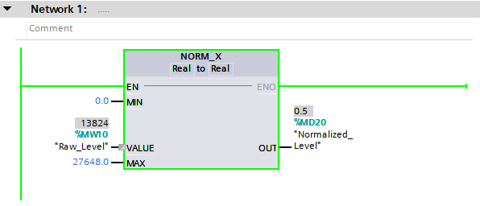
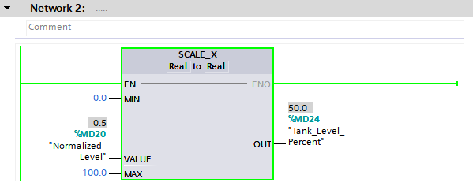
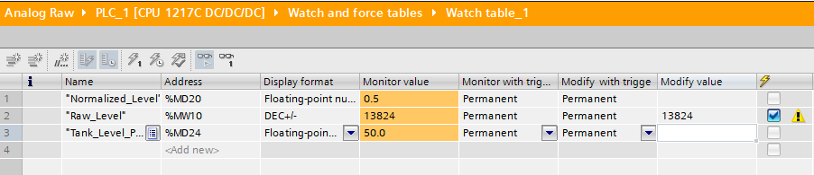
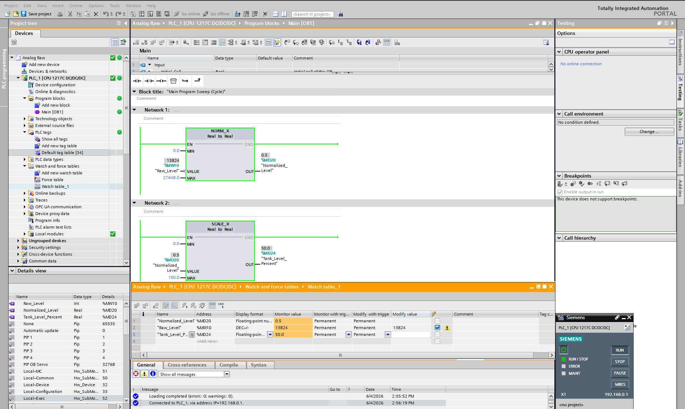
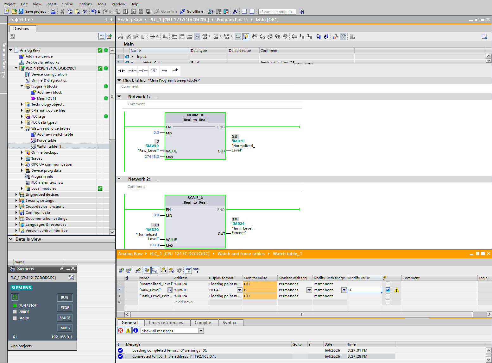
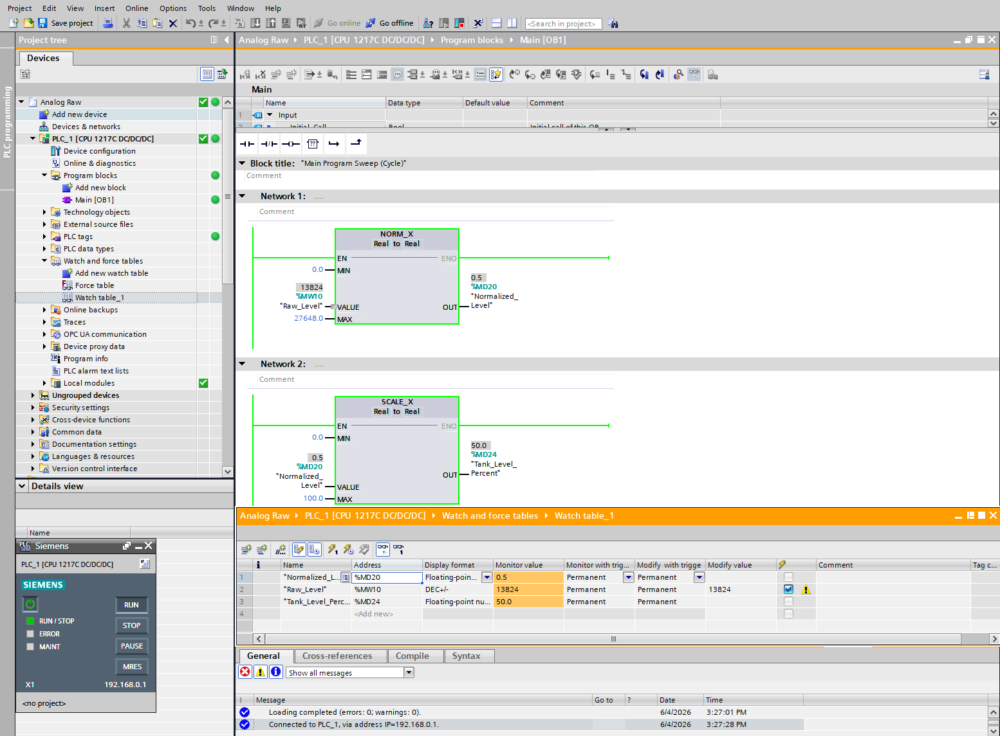
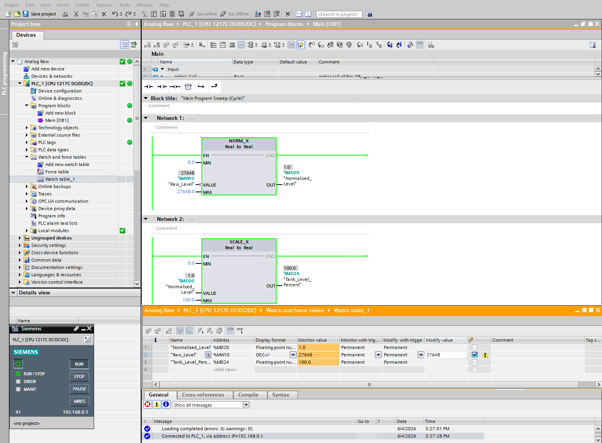

# PLC Analog Scaling System using Siemens TIA Portal

## Project Overview

This project demonstrates industrial analog signal scaling using Siemens TIA Portal and Siemens S7-1200 PLC programming.

The system converts a raw analog input value into a meaningful engineering value using Siemens standard scaling instructions.

The project simulates a tank level measurement system where a raw PLC value is converted into a percentage level indication.

### Industrial Instructions Used

* NORM_X
* SCALE_X

This technique is widely used in:

* Tank level monitoring
* Pressure measurement
* Flow measurement
* Temperature monitoring
* Process instrumentation

---

# Objective

Convert a raw analog value received by the PLC into a meaningful engineering value.

## Scaling Flow

```text
Raw Analog Value
(0 – 27648)

        ↓

NORM_X
(0.0 – 1.0)

        ↓

SCALE_X
(0 – 100%)

        ↓

Tank Level Percentage
```

---

# System Description

The PLC receives a simulated raw analog input value.

The program performs:

1. Analog signal normalization using NORM_X
2. Engineering unit conversion using SCALE_X
3. Real-time monitoring through Watch Tables
4. Validation using multiple test values

---

# PLC Concepts Used

* Analog Signal Processing
* Analog Scaling
* NORM_X Instruction
* SCALE_X Instruction
* INT Data Type
* REAL Data Type
* Watch Tables
* Online Monitoring
* Engineering Unit Conversion

---

# Tags Used

| Tag                | Address | Type | Description                  |
| ------------------ | ------- | ---- | ---------------------------- |
| Raw_Level          | %MW10   | INT  | Simulated raw analog value   |
| Normalized_Level   | %MD20   | REAL | Normalized value             |
| Tank_Level_Percent | %MD30   | REAL | Scaled tank level percentage |

---

# Program Screenshots

## NORM_X Logic



The NORM_X instruction converts the raw analog input range of 0–27648 into a normalized value between 0.0 and 1.0.

---

## SCALE_X Logic



The SCALE_X instruction converts the normalized value into a tank level percentage ranging from 0% to 100%.

---

## Watch Table Monitoring



The Watch Table is used to monitor tag values in real time during simulation.

---

## Online Monitoring



Online monitoring verifies correct execution of the scaling logic while the PLC program is running.

---

# Scaling Logic

## Step 1 — NORM_X

Converts:

```text
0 – 27648

↓

0.0 – 1.0
```

---

## Step 2 — SCALE_X

Converts:

```text
0.0 – 1.0

↓

0 – 100%
```

---

# Validation Test Results

The analog scaling logic was verified using multiple test values.

| Raw Input | Tank Level Percentage |
| --------- | --------------------- |
| 0         | 0%                    |
| 13824     | 50%                   |
| 27648     | 100%                  |

---

## Test Case 1 — Empty Tank

Raw Input:

```text
0
```

Expected Output:

```text
0%
```



---

## Test Case 2 — Half Tank

Raw Input:

```text
13824
```

Expected Output:

```text
50%
```



---

## Test Case 3 — Full Tank

Raw Input:

```text
27648
```

Expected Output:

```text
100%
```



---

# Software Used

* Siemens TIA Portal
* Siemens PLCSIM

---

# Skills Demonstrated

* PLC Programming
* Industrial Automation
* Analog Signal Scaling
* Process Instrumentation
* Siemens TIA Portal Development
* REAL Datatype Handling
* Engineering Unit Conversion
* Industrial Process Monitoring

---

# Real Industrial Applications

This scaling technique is commonly used in:

* Water Treatment Plants
* Chemical Processing Industries
* Oil & Gas Facilities
* HVAC Systems
* Storage Tank Monitoring
* Manufacturing Plants
* Process Control Systems

---

# Project Structure

```text
plc-analog-scaling-system
│
├── screenshots
│   ├── norm_x_logic.png
│   ├── scale_x_logic.png
│   ├── watch_table.png
│   ├── online_monitoring.png
│   ├── test_value_0_percent.png
│   ├── test_value_50_percent.png
│   └── test_value_100_percent.png
│
├── tia_project
│   └── analog_scaling_system.zap19
│
└── README.md
```

---

# Future Improvements

* Analog Input Card Integration
* HMI Visualization
* Alarm Limits
* Analog Signal Filtering
* Simulated Tank Process
* PID Level Control
